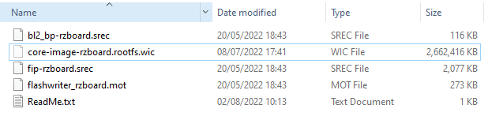
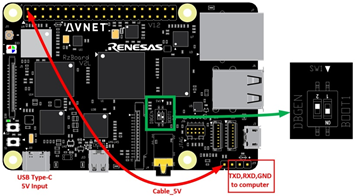
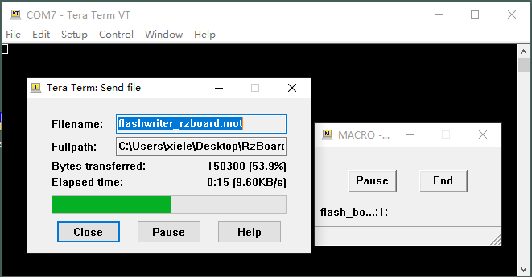
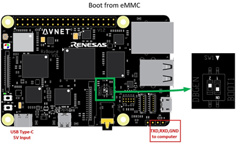
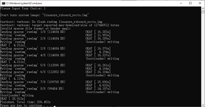

# Simplified Programming Procedure

In order to make development more convenient, we have designed some small script programs for programming programs. This section will introduce the relevant tools and specific steps for using these small script programs to program Flash and eMMC.

## Use flash_bootloader.ttl to program Bootloader Images to Flash or eMMC

We can use the script **flash_bootloader.ttl** to program bootloader images to Flash or eMMC  through the following steps:

1.Put all bootloader images to the folder /images



2.Connect debug serial (TXD,RXD,GND) to PC, Connect Boot2 (Pin1 of J19) to 5V, Set SW1 as shown below:



3.Edit the TTL script **flash_bootloader.ttl** by any editor on windows(such as notepad) to configure the following two parameters according to your development environment.

```
; #### You probably need to modify the COM port here ####
COM = 5

; #### You probably need to modify the target here ####
; Program QSPI or eMMC: 1->QSPI  0->eMMC
QSPI_NOT_eMMC = 1
```

4.To run the TTL script, you can **right-click it** and choose **"Open with" -> "Choose another app" -> "More apps" -> "Look for another app on this PC"**, then **choose program "ttpmacro.exe"** in the Tera Term installation location, such as **"C:\Program Files (x86)\teraterm"** here.


5.Power on the board with a 5V, Type-C interface power (to J10).

**Note: Must run the TTL script before powering on the board.**

6.The TTL script will automatically start **Tera Term** program, and flash bootloader images into QSPI flash or eMMC, which is configured in the TTL script.



Wait for the script running automatically, and no input or operation is required during this period. After finishing, the **TTL script and Tera Term will exit. ** Then you can set RzBoard to boot from QSPI or eMMC as your needs.


## Use flash_system_image.ttl to program System Images to eMMC

We can use the script **flash_system_image.ttl** to program linux sysytem images to eMMC  through the following steps:

1.Put the Linux system image to the folder /images, here take **core-image-rzboard.rootfs.wic** for an example,


2.Configure the hardware environment: 

|      Elements       |                            Action                            |
| :-----------------: | :----------------------------------------------------------: |
|      Boot Mode      | eMMC boot mode (Set Sw1 as shown below, Boot2 connect to GND or floating) |
| USB Type-c 5V Input |                Connect to 5V DC power supply                 |
|    Debug Serial     |        Connect to PC (Recommended USB to serial port)        |
|       SD card       |    Out (To programme to EMMC, SD card must be pulled out)    |
|    Network Port     |           Connect to the network by network cable            |



3.Edit the TTL script **flash_system_image.ttl**  by any editor on windows(such as notepad) to configure the following parameters according to your development environment.

```
; +----------------------------------+
; |         Macro Parameters         |
; +----------------------------------+

; #### You probably need to modify the COM port here ####
COM = 7

; #### You probably need to modify the U-boot IP address here ####
ipstr='192.168.2.56'

; #### You probably need to modify the system image name here ####
SYSIMG_FILE  = "images/core-image-rzboard.rootfs.wic"
```


4.To run the TTL script, you can **right-click it** and choose **"Open with" -> "Choose another app" -> "More apps" -> "Look for another app on this PC"**, then **choose program "ttpmacro.exe"** in the Tera Term installation location, such as **"C:\Program Files (x86)\teraterm"** here.


5.Power on the board with a 5V, Type-C interface power (to J10).

**Note: Must run the TTL script before powering on the board.**

6.The TTL script will automatically start **Tera Term** program, and flash the Linux system image into eMMC.



Wait for the script to be automatically programmed, and no input or operation is required during this period. After finishing, the **TTL script and Tera Term will exit. ** Then you can set RzBoard to boot from QSPI or eMMC as your needs.


