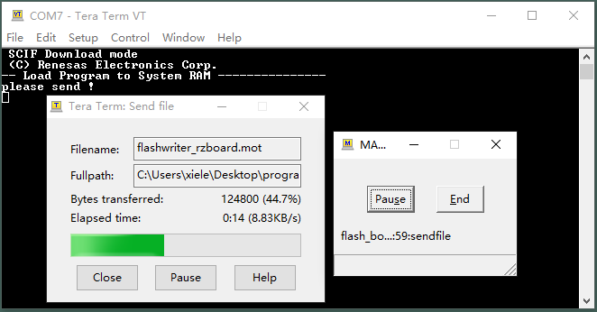
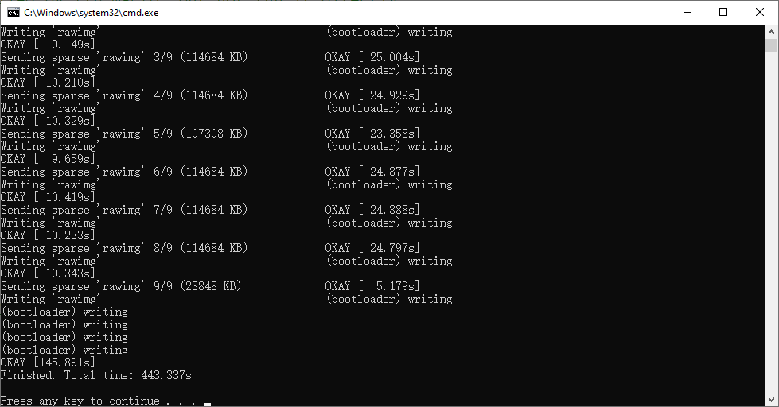

# Simplified Programming Procedure

In order to make development more convenient, we have designed some small script programs for programming programs. This section will introduce the relevant tools and specific steps for using these small script programs to program Flash and eMMC.

## Use flash_bootloader.bat to program Bootloader Images to Flash or eMMC

RZBoard has two boot modes: **boot from QSPI or eMMC**. If you plan to boot from QSPI, you need to program the bootloader images to QSPI, or program the bootloader images to EMMC and start from EMMC. **The bootloader images written to QSPI are the same as the bootloader images written to EMMC,** as shown following: ***flashwriter_rzboard.mot, bl2_bp-rzboard.srec, fip-rzboard.srec***. We can use the script **flash_bootloader.bat** to program bootloader images to Flash or eMMC  through the following steps:

1.Put all bootloader images to the folder /images


2.Connect debug serial (TXD,RXD,GND) to PC, Connect Boot2 (Pin1 of J19) to 5V, Set SW1 as shown below:


3.Edit **config.ini** by any editor on windows(such as notepad) to configure the parameters according to your development environment.

```
[COMMON]
COM=7

[BOOTLOADER]
FLASH_WRITER=flashwriter_rzboard.mot
FILE_BL2=bl2_bp-rzboard.srec
FILE_FIP=fip-rzboard.srec
```

4.Run **flash_bootloader.bat** and choose the program media (eMMC or QSPI Flash). It will automatically launch **Tera Term** program and wait for system power up.


5.Power on the board with a 5V, Type-C interface power (to J10). It will start to flash bootloader images into QSPI flash or eMMC as your choice.



Wait for the script running automatically, and no input or operation is required during this period. After finishing, the **BAT script and Tera Term will automatically exit**. Then you can set RzBoard to boot from QSPI or eMMC as your needs.


## Use flash_system_image.bat to program System Images to eMMC

We can use the script **flash_system_image.bat** to program linux system images to eMMC  through the following steps:

1.Put the Linux system image to the folder /images, here take **core-image-rzboard.rootfs.wic** for an example,


2.Configure the hardware environment: 

|      Elements       |                            Action                            |
| :-----------------: | :----------------------------------------------------------: |
|      Boot Mode      | eMMC boot mode (Set Sw1 as shown below, Boot2 connect to GND or floating) |
| USB Type-c 5V Input |                Connect to 5V DC power supply                 |
|    Debug Serial     |        Connect to PC (Recommended USB to serial port)        |
|       SD card       |     Out (To program to EMMC, SD card must be pulled out)     |
|    Network Port     |           Connect to the network by network cable            |


3.Edit **config.ini** by any editor on windows(such as notepad) to configure the parameters according to your development environment.

```
[COMMON]
COM=7
IPADDR=192.168.2.56

[SYSTEM]
FILE_SYSIMG=core-image-rzboard.rootfs.wic
```


4.Run **flash_system_image.bat** and it will automatically launch **Tera Term** program.


5.Power on the board with a 5V, Type-C interface power (to J10).

**Note: Must run the BAT script before powering on the board.**

6.It will automatically start **Tera Term** program and launch a **new BAT script**, which used to flash the Linux system image into eMMC.



Wait for the script to be automatically programmed, and no input or operation is required during this period. After finishing, you can **press any key to exit the BAT script** . And then you can set RzBoard to boot from QSPI or eMMC as your needs.
